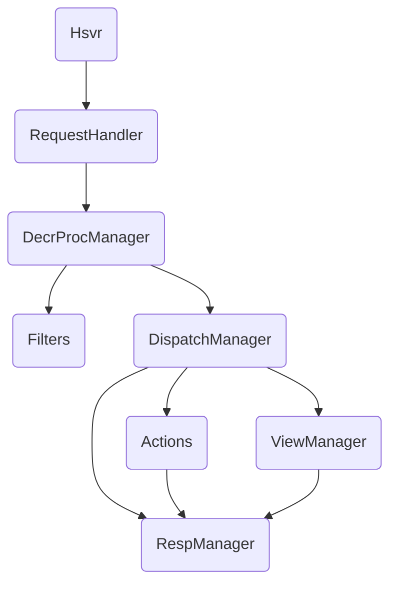

# HSVRServer 轻量级多线程 HTTP 服务

## 项目简介
这是一个基于 Python 标准库 `http.server` 与 `socketserver` 构建的轻量级多线程 HTTP 服务。项目采用装饰器注册的方式组织路由（actions）、视图（views）与过滤器（filters），提供静态文件服务、模板渲染、表单/JSON/二进制上传等能力，并包含一个可直接使用的 SwitchHost 演示模块（管理系统 hosts 的规则切换与应用）。

## 主要功能
- 多线程 HTTP 服务（ThreadingMixIn + HTTPServer）
- 路由注册（GET/POST actions）
- 视图模板渲染（替换式占位）
- 请求过滤器（统一前置校验/解析）
- 静态文件服务（自动 Content-Type，2MB 以上分块写出）
- 表单（urlencoded/multipart）、JSON、二进制上传
- SwitchHost 模块：图形化管理 hosts，支持增改、启用、保存与应用系统（需管理员权限）

## 目录结构

```
HVSRServer/
├── static/ # 静态资源目录
│ ├── index.html
│ └── switchhost.html
├── views/ # 视图目录（可配置）
│ ├── switchhost/
│ │ ├── index.html # 中文页面
│ │ ├── index_en.html # 英文页面
│ │ └── indexzh.html # 中文页面（可选）
│ ├── hello.html
│ └── index.html
├── conf.ini # 运行配置
├── hsvrmain.py # 程序入口（示例）
├── hsvrserver.py # 服务器封装与装饰器入口
├── hsvrdispatch.py # 路由分发器
├── hsvrdecrproc.py # 装饰器注册管理（actions/views/filters）
├── hsvrreq.py # 请求解析与上传工具
├── hsvrresp.py # 响应输出（静态/HTML/JSON/重定向）
├── hsvrview.py # 模板渲染工具
├── hsvrbase.py # 单例配置、日志转发、耗时装饰器等
├── hsvrsample_actions.py # actions 示例
├── hsvr_sample_filters.py # filters 示例
├── hsvr_sample_views.py # views 示例
└── hsvr_switchhost.py # SwitchHost Demo 模块
```

## 快速开始
- 准备 Python 3.8+ 环境（无需额外依赖）
- 配置 `conf.ini`（默认即可运行）
- 启动服务 python hsvrmain.py

- 控制台将打印端口与访问提示，示例页面：
  - 静态资源：`http://localhost:8000/static`
  - 视图示例：`http://localhost:8000/views/index`
  - SwitchHost：`http://localhost:8000/switchhost`

## 配置说明（conf.ini）
关键配置项：
- `http_server_ip`, `http_server_port`: 绑定地址与端口
- `http_server_env`: 运行环境（DEV 输出控制台；非 DEV 输出日志文件）
- 路由前缀：`http_server_uri_action`, `http_server_uri_static`, `http_server_uri_views`
- 目录配置：`http_server_static_dir`, `http_server_views_dir`, `http_server_upload_dir`
- SwitchHost：`switchhost.hosts_file_path_win`, `switchhost.hosts_save_dir`

## 架构与模块


## 模块说明
- Hsvr（hsvrserver.py）：封装 HTTPServer 与装饰器入口（get/post/filters/view）
- DecrProcManager（hsvrdecrproc.py）：管理注册项，统一 GET/POST 过滤与解析
- DispatchManager（hsvrdispatch.py）：按 URI 分发至静态、actions 或 views
- ReqManager（hsvrreq.py）：解析 query/form/json/octet-stream，支持分块读取上传
- RespManager（hsvrresp.py）：静态/HTML/JSON 响应；大文件分块写出；客户端断开静默处理
- ViewManager（hsvrview.py）：替换式模板渲染（{#(key)#}）
- AppConf/Log（hsvrbase.py）：单例配置与日志转发（非 DEV 环境每日滚动）

## 路由与 API

### 静态文件
- GET /static 或 /static/*：响应静态资源（自动 Content-Type，大文件分块响应）
### 示例 Actions
- GET /action/info：{"ret_code":0,"ret_msg":"success","data":{"info":"rest info"}}
- GET /act/hello：{"ret_code":0,"ret_msg":"success","data":{"get_act_hello":"rest act_hello"}}
- POST /act/hello：{"ret_code":0,"ret_msg":"success","data":{"post_act_hello":"rest act_hello"}}
### 示例 Views
- GET /views/index、/views/hello?name=Tom
### SwitchHost
- GET /switchhost：根据 Accept-Language 返回 index_zh.html 或 index_en.html（默认英文），回退 index.html
- GET /switchhost/api/add?name=xxx：新增条目
- GET /switchhost/api/edit?id=xx&name=yyy：修改名称（系统 hosts id=0 禁止改名）
- GET /switchhost/api/get_hosts_txt?id=xx：返回文本与文件路径
- POST /switchhost/api/save：表单保存（id, host_txt, opened='on'/'off'），opened=on 则写入系统 hosts 并刷新 DNS
- GET /switchhost/api/changehosts?id=xx&opened=on|off：切换启用状态；opened=on 写入系统 hosts 并刷新 DNS

## SwitchHost Demo 使用说明

### 页面入口：/switchhost
### 左侧列表：显示规则条目（系统 hosts 固定为 id=0）
### 交互说明：
- “新增规则”：输入标题后新增条目
- “编辑”：修改选中规则标题（非系统项）
- “切换开关”（toggle）：选中该规则并调用 changehosts；仅一个开关为 ON
- “保存”：将编辑区文本保存到对应规则；当 opened=on 时同步写入系统 hosts 并刷新 DNS
### 国际化：
- 根据浏览器语言自动返回中文/英文页面（默认英文），保留相同占位符与交互逻辑
### 权限要求（Windows）：
- 写入系统 hosts 需要以管理员模式运行应用；否则将返回 403 与友好提示

## 开发规范与注意
- 模板渲染统一使用替换式占位 {#(key)#}，避免 str.format 键名限制
- 大文件响应与上传采用分块读取写出生成器，避免高内存占用
- 客户端主动断开连接（ConnectionAbortedError/Reset/BrokenPipe）仅记录简要日志，不打印堆栈
- JSON 响应统一结构：{"ret_code":<int>,"ret_msg":"<string>","data":{...}}

## 常见问题
### 权限错误：
- 保存/切换写系统 hosts 时若非管理员，将返回 ret_code=1001 且附带系统路径提示
### 非 JSON 返回：
- 前端 AJAX 保存逻辑将弹窗提示“返回类型非JSON”，请检查服务端响应头与路由
### 模板文件路径：
- 视图根目录优先使用 conf.ini 中配置，避免硬编码导致部署差异

## 许可证

MIT