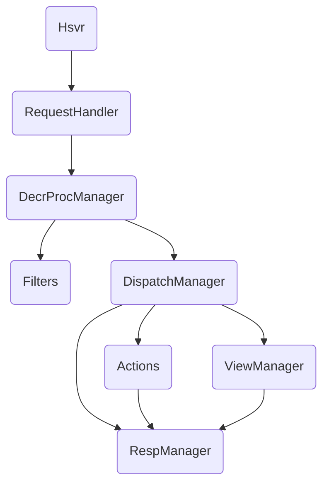

# HSVRServer Lightweight Multithreaded HTTP Service

## Overview
A lightweight multithreaded HTTP server built on Python standard libraries `http.server` and `socketserver`. It organizes routes (actions), views and filters via decorators, supports static serving, template rendering, form/JSON/binary uploads, and includes a ready-to-use SwitchHost demo module to manage and apply multiple hosts rules.

## Features
- Multithreaded HTTP server (ThreadingMixIn + HTTPServer)
- Declarative route registration (GET/POST actions)
- Template rendering (replacement placeholders)
- Unified request filters (pre-check + payload parsing)
- Static files (auto Content-Type; chunked write for large files)
- Form (urlencoded/multipart), JSON and binary upload
- SwitchHost demo: GUI for hosts rules, add/edit/apply/flush DNS

## Tree
See project root structure in README (Chinese). Key modules:
- [hsvrserver.py](./HSVRServerhsvrserver.py): server wrapper and decorator entry
- [hsvrdecrproc.py](./HSVRServerhsvrdecrproc.py): decorator manager (actions/views/filters)
- [hsvrdispatch.py](./HSVRServerhsvrdispatch.py): URI dispatch to static/actions/views
- [hsvrreq.py](./HSVRServerhsvrreq.py): request parsing and uploads (chunked)
- [hsvrresp.py](./HSVRServerhsvrresp.py): responses (static/HTML/JSON/redirect)
- [hsvrview.py](./HSVRServerhsvrview.py): template rendering (replacement)
- [hsvrbase.py](./HSVRServerhsvrbase.py): singleton config, logging redirect, elapsed decorator
- [hsvr_switchhost.py](./HSVRServerhsvr_switchhost.py): SwitchHost demo

## Quick Start
- Python 3.8+
- Edit [conf.ini](./HSVRServerconf.ini) if needed
- Run: python hsvrmain.py

- Visit:
  - Static: `http://localhost:8000/static`
  - Views: `http://localhost:8000/views/index`
  - SwitchHost: `http://localhost:8000/switchhost`

## Config (conf.ini)
- `http_server_ip`, `http_server_port`
- `http_server_env` (DEV: console; non-DEV: daily rolling file)
- Prefix: `http_server_uri_action/static/views`
- Dirs: `http_server_static_dir`, `http_server_views_dir`, `http_server_upload_dir`
- SwitchHost: `hosts_file_path_win`, `hosts_save_dir`

## Architecture

## Routes & APIs
### Static
- GET /static or /static/*: static file response (auto Content-Type; chunked for large files)
### Sample actions
  - GET /action/info, GET /act/hello, POST /act/hello
### Sample views
- GET /views/index, /views/hello?name=Tom
### SwitchHost
- GET /switchhost: return index_zh.html when Accept-Language contains zh, otherwise index_en.html; fallback to index.html
- GET /switchhost/api/add?name=xxx
- GET /switchhost/api/edit?id=xx&name=yyy
- GET /switchhost/api/get_hosts_txt?id=xx
- POST /switchhost/api/save (id, host_txt, opened='on'/'off'): when opened='on', write to system hosts and flush DNS
- GET /switchhost/api/changehosts?id=xx&opened=on|off

## SwitchHost Demo Guide
### Entry: /switchhost
- Sidebar: rules list (system hosts is id=0)
### Operations:
- Add rule, Edit rule title (non-system)
- Toggle (only one ON): select rule & call changehosts
- Save: persist host text; when opened='on', write system hosts and flush DNS
### i18n:
- Return zh/en page by Accept-Language (default: English)
### Permissions (Windows):
- Writing system hosts requires running as Administrator; otherwise returns 403 with hint

## Development Notes
- Templates use replacement placeholders {#(key)#}; avoid str.format key restrictions
- Large file: generator-chunk reading/writing to reduce memory
- Client abort exceptions (ConnectionAbortedError/Reset/BrokenPipe) are logged briefly, no stack trace
## FAQ
### Permission error:
Returns ret_code=1001 with system path when not running as admin
### Non-JSON response:
Frontend shows error dialog; check server response headers
### Template path:
Views root prefer conf.ini configuration; avoid hard-coded paths

## License

MIT
